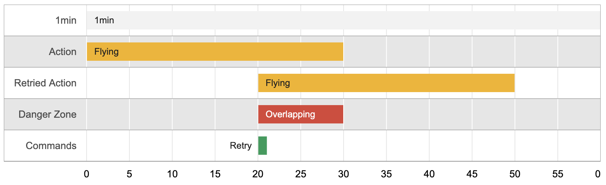
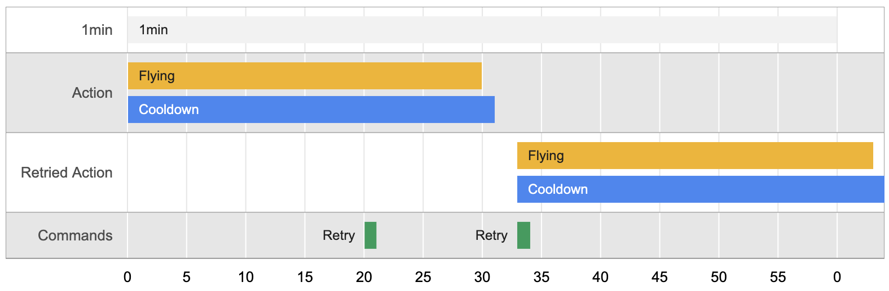
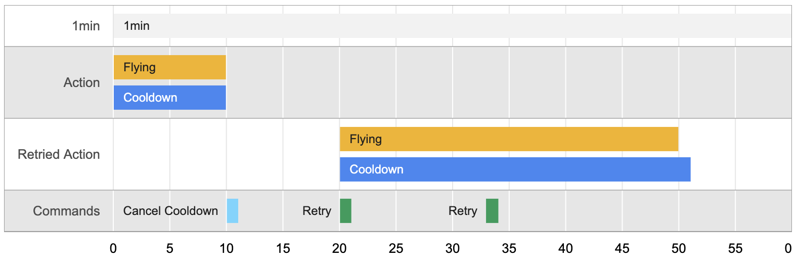

<h2 align="center">At least once delivery of Redux Actions</h2>

# Installation

```bash
yarn add redux-action-retry
```

# Getting Started
## Basic Configuration

```ts
import uuid from 'uuid/v4';
import { REDUX_ACTION_RETRY } from 'redux-action-retry';

// actions to retry
export const SEND_LOGS_TO_SERVER = 'SEND_LOGS_TO_SERVER';
export const NOTIFY_ACTION = 'NOTIFY_ACTION';

// action creators
export function sendLogsToServerActionCreator() {
  return {
    type: SEND_LOGS_TO_SERVER,
    // meta must be config
    meta: {
      [REDUX_ACTION_RETRY]: {
        // the id will be used to identify the action in the cache.
        id: uuid()
      }
    }
  }
}
```

```ts
import {
  createStore,
  combineReducers,
  applyMiddleware,
} from 'redux';

import { createRetryMechanism } from 'redux-action-retry';
import { SEND_LOGS_TO_SERVER, NOTIFY_ACTION } from './actions';

const { reducer, reduxActionRetryMiddlewares, stateKeyName } = createRetryMechanism({
  cache: {
    // action types are keys
    [SEND_LOGS_TO_SERVER]: {
      type: SEND_LOGS_TO_SERVER,
    },
    [NOTIFY_ACTION]: {
      type: NOTIFY_ACTION,
    },
  },
});

export const store = createStore(
  combineReducers({
    // Use the stateKeyName as the key name of the reducer, as needed for the retry mechanism middlewares.
    [stateKeyName]: reducer
  }),
  applyMiddleware
    (
      // Spread the middlewares
      ...reduxActionRetryMiddlewares,
    )
);
```

## Remove action from cache

When actions are dispatched, the middleware immediately caches the action, if the action is successful you can remove it dispatching a remove action.

```ts
import { put } from 'redux-saga/effects'
import { removeActionCreator } from 'redux-action-retry';

function* sendLogsToServer(action) {
  // domain logic...
  // ...

  // if all good then remove from retry mechanism
  yield put(removeActionCreator(action))
}
```

## Retry actions

When retrying is needed you can dispatch a retry all action.

```ts
import { put } from 'redux-saga/effects'
import { retryAllActionCreator } from 'redux-action-retry';

function* appForeground() {
  // domain logic...
  // ...

  // retry all cached actions
  yield put(retryAllActionCreator())
}
```

## Reset Store

```ts
import {
  resetActionCreator,
} from 'redux-action-retry';

function logout() {
  // domain logic...
  // ...

  // reset the store for redux-action-retry
  dispatch(resetActionCreator())
}
```

# Advanced Usage
## Cooldown

Without cooldown timeline


With cooldown timeline


The amount of time an action could take executing (**Flying time**) might be indicated, for example, by the timeout of a request, if a request is bound to fail after 30 seconds by timeout, then the action could be flying for at least 30 seconds.

Often when actions are dispatched, we wouldn't want them to be retried before we know they've succeeded or failed.


### Configuration

```ts
export const REQUEST_TIMEOUT = duration('PT30S');
```

```ts
import {
  createStore,
  combineReducers,
  applyMiddleware,
} from 'redux';
import { duration } from "moment";
import { createRetryMechanism, Cooldown } from 'redux-action-retry';
import { SEND_LOGS_TO_SERVER, NOTIFY_ACTION } from './actions';

const { reducer, reduxActionRetryMiddlewares, stateKeyName } = createRetryMechanism({
  cache: {
    [SEND_LOGS_TO_SERVER]: {
      type: SEND_LOGS_TO_SERVER,
      // cooldown config is per action
      cooldownTime: duration('PT31S'),
    },
    [NOTIFY_ACTION]: {
      type: NOTIFY_ACTION,
      // As a rule of thumb add a bit more of time to allow for actual code and framework delays.
      cooldownTime: duration('PT31S'),
    },
    extensions: [
      Cooldown,
    ]
  },
});

export const store = createStore(
  combineReducers({
    [stateKeyName]: reducer
  }),
  applyMiddleware
    (
      ...reduxActionRetryMiddlewares,
    )
);
```

### Early response


Cancel cooldown timeline

In the case of an early fail response we might want the action be to be retryable sooner than the cooldown time, so we might want to cancel it.

```ts
import { put } from 'redux-saga/effects'
import { cancelCooldownActionCreator } from 'redux-action-retry';

function* sendLogsToServer(action) {
  // domain logic...
  // ...

  if(allGood) {
    yield put(removeActionCreator(action))
  } else {
    // in case of early fail
    yield put(cancelCooldownActionCreator(action))
  }
}
```

### Cool and Retry All utility

In case we want to Retry All without caring for the cooldown time, dispatch a **coolAndRetryAllActionCreator**.

```ts
import { coolAndRetryAllActionCreator } from 'redux-action-retry';

function* rehydrate(action) {
  // domain logic...
  // ...

  yield put(coolAndRetryAllActionCreator(action))
}
```

## Times

State without times:
```json
{"REDUX_ACTION_RETRY": {
        "cache": [{
                "action": {
                    "type": "SEND_LOGS_TO_SERVER",
                    "meta": {
                        "REDUX_ACTION_RETRY": {
                            "id": "3b2a7b5f-47f8-4774-af84-d28c5ecb61a7"
                        }
                    }
                },
            }]}}
```
State with times:
```json
{ "REDUX_ACTION_RETRY": {
        "cache": [{
                "action": {
                    "type": "SEND_LOGS_TO_SERVER",
                    "meta": {
                        "REDUX_ACTION_RETRY": {
                            "id": "3b2a7b5f-47f8-4774-af84-d28c5ecb61a7"
                        }
                    }
                },
                "times": 5
            }]}}
```

In case you want to add a counter of the times an action have been retried, use the **Times** Extension.

### Configuration

```ts
import {
  createStore,
  combineReducers,
  applyMiddleware,
} from 'redux';
import { duration } from "moment";
import { createRetryMechanism, times } from 'redux-action-retry';
import { SEND_LOGS_TO_SERVER, NOTIFY_ACTION } from './actions';

const { reducer, reduxActionRetryMiddlewares, stateKeyName } = createRetryMechanism({
  cache: {
    [SEND_LOGS_TO_SERVER]: {
      type: SEND_LOGS_TO_SERVER,
    },
    [NOTIFY_ACTION]: {
      type: NOTIFY_ACTION,
    },
    extensions: [
      times,
    ]
  },
});

export const store = createStore(
  combineReducers({
    [stateKeyName]: reducer
  }),
  applyMiddleware
    (
      ...reduxActionRetryMiddlewares,
    )
);
```

### Use cases
#### Debugging / reports
In case of debugging or reading reports, having a count of how many times an action actually failed is very useful.

#### Optimistic response
We might want to keep triggering one saga but not the reducer, in those cases we could add a middleware to consume the action based on the times counter.
#### Cease retrying
In case we want to cease retrying after a number of attempts we could add a middleware that dispatches a remove command based on the times counter.

## Time to live

In case we want to cease retrying after an amount of time, we could use **Time to live** extension.

Dead actions are prevented from retrying, but when to remove those from the cache is up to the user (might want to send for stats/reports).

### Configuration
```ts
import {
  createStore,
  combineReducers,
  applyMiddleware,
} from 'redux';
import { duration } from "moment";
import { createRetryMechanism, TimeToLive } from 'redux-action-retry';
import { SEND_LOGS_TO_SERVER, NOTIFY_ACTION } from './actions';

const { reducer, reduxActionRetryMiddlewares, stateKeyName } = createRetryMechanism({
  cache: {
    [SEND_LOGS_TO_SERVER]: {
      type: SEND_LOGS_TO_SERVER,
      // time to live config is per action
      timeToLive: duration('P3D')
    },
    [NOTIFY_ACTION]: {
      type: NOTIFY_ACTION,
      cooldownTime: duration('P1D'),
    },
    extensions: [
      TimeToLive,
    ]
  },
});

export const store = createStore(
  combineReducers({
    [stateKeyName]: reducer
  }),
  applyMiddleware
    (
      ...reduxActionRetryMiddlewares,
    )
);
```

### How to remove dead actions

When we want to remove dead actions we dispatch a **collectGarbageActionCreator**.
```ts
import { collectGarbageActionCreator } from 'redux-action-retry';

function* rehydrate(action) {
  // domain logic...
  // ...

  yield put(collectGarbageActionCreator(action))
  // we might want to collect garbage before issuing a retry all
  yield put(coolAndRetryAllActionCreator(action))
}
```